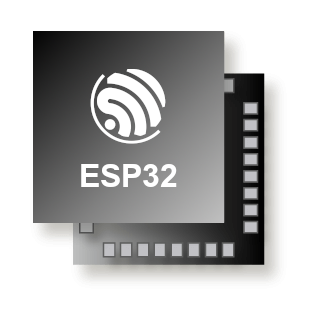
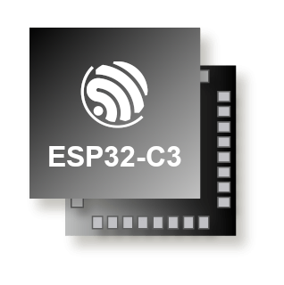

## Choose your target

[](esp32/README.md)
[](esp32s3/README.md)
[](esp32c3/README.md)

## About Espressif QEMU fork

[Espressif's QEMU project](https://github.com/espressif/qemu) contains a fork of QEMU with patches for Espressif chips support. We hope that these patches will eventually be mature enough to become part of the upstream QEMU project.

At the moment, Espressif does not provide support for QEMU. We appreciate issue reports but keep in mind that our response may be delayed. We will likely not be able to help with issues that require extensive troubleshooting or don't have a straightforward way to reproduce them. We will also likely not be able to help with particular use cases which aren't supported yet (e.g. due to missing emulation of some peripherals).

The main branch of that repository is `esp-develop`. This branch will often be rebased on top of the upstream master branch and force-pushed. If you wish to submit a non-trivial PR, please open an issue first so that we can avoid making conflicting changes.

## Disclaimer

```
This program is distributed in the hope that it will be useful,
but WITHOUT ANY WARRANTY; without even the implied warranty of
MERCHANTABILITY or FITNESS FOR A PARTICULAR PURPOSE.  See the
GNU General Public License for more details.
```
